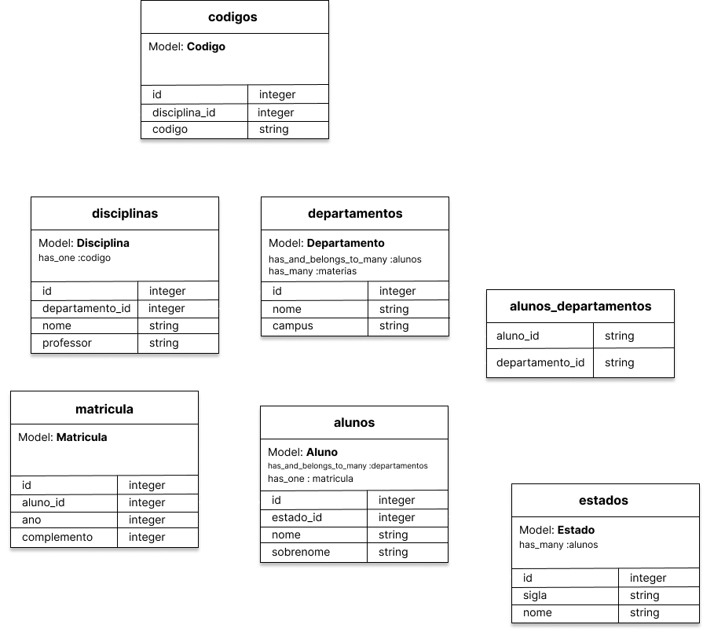

#Trabalho 2 - Banco de Dados usando ActiveRecord

* departamentos (nome, campus)
* estado (nome, sigla)
* alunos (nome, sobrenome, estado_id)
* alunos_departamentos (aluno_id, departamento_id)
* matriculas (ano, complemento, aluno_id)
* disciplinas ()